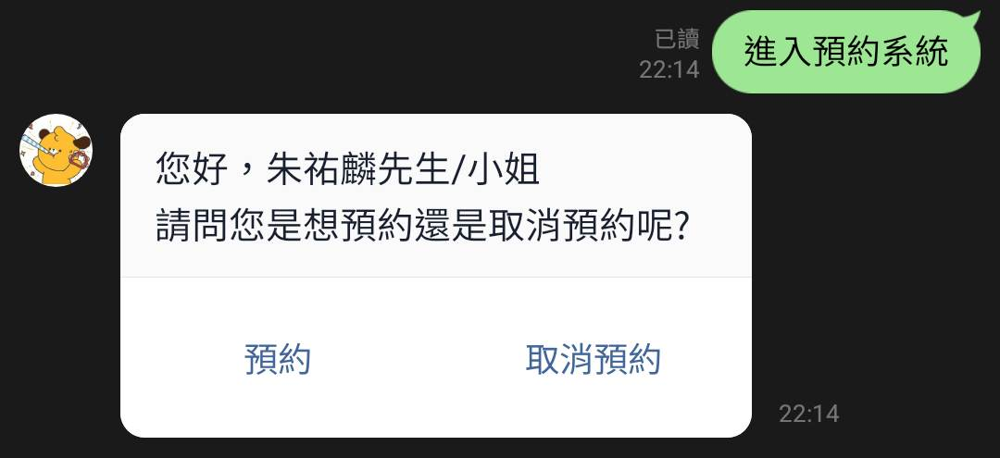

# 2022_Theory_of_computation_project
歡迎來到青年活動中心！這是一個模擬活動預約系統的 linebot！

你可以透過與linebot互動獲取青年活動的最新消息並預約參與了解我們
(以下功能以Linebot, PostgreSQL, Pytransition實作)

## FSM

它看起來超級繁雜的！這是因為為了使用者方便起見，所有 state 皆可舜切換至其他任意 state。

試試看你就知道了！使用者不需要再按錯之後「回上一動」，而是直接回去原訊息點擊正確的選項。

## 圖文選單

### 關於
取得使用說明

### 地點
取得活動中心地點

### 預約
流程如下: 

選擇欲參與活動類別:

選擇活動:

選擇日期:

選擇時間:

確定!:

### 資料庫
#### 建立使用者資料

#### 建立預約資料

### 取消預約
選擇欲取消的預約:

### 集點

### 最新消息

### 與我聯繫

取消再按對應的回應按鍵，一樣可以切回預約狀態，不須從頭預約
